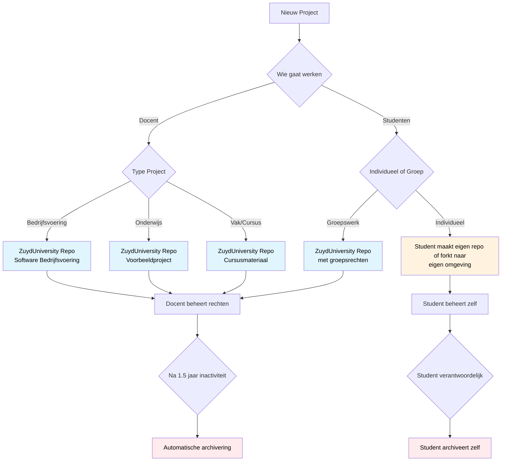

# ZuydUniversity GitHub Organisatie

Welkom bij de GitHub organisatie van de Academie ICT van Zuyd Hogeschool. Deze organisatie dient als centrale hub voor alle softwareontwikkelingsprojecten, onderwijsmaterialen en samenwerkingsplatforms binnen onze academie.

Als onderdeel van de ICT Academie faciliteren we hier het onderwijs en de samenwerking tussen docenten, studenten en externe partners. Alle repositories die gebruikt worden voor onderwijsprojecten, samenwerkingsprojecten, open source initiatieven en onderzoeks- en ontwikkelingsprojecten vinden hier hun plaats.

## Repositories

Binnen onze organisatie maken we onderscheid tussen verschillende soorten repositories, elk met hun eigen doel en beheerstructuur.

### Software voor Bedrijfsvoering
Voor software die gebruikt wordt voor de dagelijkse bedrijfsvoering van de academie, worden repositories aangemaakt die door docenten beheerd worden. Deze repositories bevatten vaak kritieke systemen en tools die de academie ondersteunt.

### Voorbeeldprojecten en Cursusmateriaal
Docenten kunnen repositories aanmaken die dienen als voorbeeldcode of opdrachtcode voor studenten. Deze repositories fungeren als referentie en leermateriaal, waardoor studenten kunnen zien hoe bepaalde concepten geïmplementeerd worden en kunnen leren van bestaande codevoorbeelden.

### Studentprojecten
Voor studentprojecten hanteren we een duidelijke werkwijze die afhangt van het type opdracht:

**Groepsprojecten**: Wanneer meerdere studenten samenwerken aan een opdracht, wordt er binnen de ZuydUniversity organisatie gewerkt. Studenten krijgen specifieke rechten op de betreffende repository, zodat ze effectief kunnen samenwerken terwijl de docent overzicht houdt.

**Individuele opdrachten**: Voor individuele werkzaamheden maken studenten een fork van de originele repository naar hun eigen GitHub omgeving. Dit geeft hen de vrijheid om zelfstandig te werken zonder invloed op het originele project of de werk van medestudenten.

## Repository Workflow

## Rechten en Toegang

De organisatie hanteert een gestructureerde benadering voor toegangsbeheer, waarbij verschillende rollen verschillende verantwoordelijkheden hebben.

### Administratoren
Rob en Viktor fungeren als eigenaren van de organisatie en zijn verantwoordelijk voor de inrichting, het onderhoud en het beantwoorden van technische vragen. Zij zorgen ervoor dat de organisatie optimaal functioneert en ondersteunen gebruikers bij complexere technische uitdagingen.

### Docenten
Docenten hebben member-rechten binnen de organisatie en mogen repositories aanmaken voor vakken, studentgroepen en projecten. Zij bepalen de rechten op repository niveau op basis van de specifieke vereisten van hun project of cursus. Wil je als docent member worden van de organisatie? Neem dan contact op met één van de beheerders.

### Studenten en Externen
Studenten en externe partijen worden toegevoegd als outside collaborators. Dit betekent dat zij geen organisatie-brede rechten hebben, maar wel toegang kunnen krijgen tot specifieke repositories waar ze zijn toegevoegd. Deze aanpak zorgt voor een veilige omgeving waarbij alleen relevante toegang wordt verleend.

## Archivering en Onderhoud

Om de organisatie overzichtelijk en actueel te houden, hanteren we een duidelijk archiveringsbeleid.

### Automatische Repository Archivering
Repositories die gedurende 1,5 jaar geen activiteit vertonen, worden automatisch gearchiveerd. Dit houdt de actieve projectenlijst overzichtelijk en zorgt ervoor dat verouderde projecten niet in de weg staan van actuele ontwikkelingen.

### Persoonlijke Verantwoordelijkheid
Voor repositories die studenten hebben geforkt naar hun eigen omgeving geldt dat zij zelf verantwoordelijk zijn voor het archiveren. Deze persoonlijke repositories vallen buiten het automatische archiveringsbeleid van de organisatie.

### Repository Verwijdering
Repositories die niet voldoen aan de organisatievoorwaarden worden verwijderd. Dit betreft bijvoorbeeld individueel werk dat niet thuishoort in de organisatie of projecten die geen relatie hebben met de academie. Deze maatregel zorgt ervoor dat de organisatie gefocust blijft op haar onderwijsdoelstellingen.

### Gebruikerstoegang Beheer
Regelmatig wordt gecontroleerd of voormalige werknemers en studenten nog toegang hebben tot repositories. Wanneer personen niet meer ingeschreven staan bij de academie of niet meer actief zijn binnen projecten, wordt hun toegang ingetrokken. Dit proces waarborgt de veiligheid en actualiteit van onze samenwerkingsomgeving.

